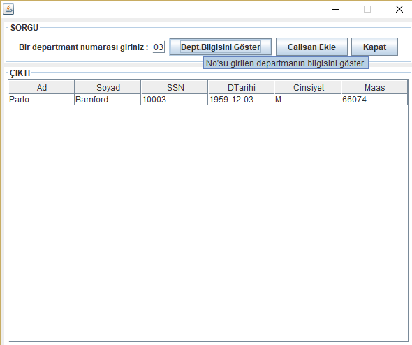

# DepartmentInformation
PostgreSQL kullanarak, bir arayüz aracılığıyla bazı sorguların yapılmasını sağlayan uygulama.

Uygulamada kullanılan örnek veri tabanının PostgreSQL'de oluşturulması :

[source,sql]
----
CREATE TYPE gender AS ENUM('M', 'F');

CREATE TABLE employees (
    emp_no      INT             NOT NULL,
    birth_date  DATE            NOT NULL,
    first_name  VARCHAR(14)     NOT NULL,
    last_name   VARCHAR(16)     NOT NULL,
    gender      gender 		NULL,    
    PRIMARY KEY (emp_no)
);

CREATE TABLE departments (
    dept_no     CHAR(4)         NOT NULL,
    dept_name   VARCHAR(40)     NOT NULL,
    PRIMARY KEY (dept_no),
    UNIQUE   	(dept_name)
);

CREATE TABLE dept_manager (
   dept_no      CHAR(4)         NOT NULL,
   emp_no       INT             NOT NULL,
   FOREIGN KEY (emp_no)  REFERENCES employees (emp_no)    ON DELETE CASCADE,
   FOREIGN KEY (dept_no) REFERENCES departments (dept_no) ON DELETE CASCADE,
   PRIMARY KEY (emp_no,dept_no)
); 

CREATE INDEX dept_manager_dept_no_idx ON dept_manager(dept_no);

CREATE TABLE dept_emp (
    emp_no      INT             NOT NULL,
    dept_no     CHAR(4)         NOT NULL,
    FOREIGN KEY (emp_no)  REFERENCES employees   (emp_no)  ON DELETE CASCADE,
    FOREIGN KEY (dept_no) REFERENCES departments (dept_no) ON DELETE CASCADE,
    PRIMARY KEY (emp_no,dept_no)
);

CREATE INDEX dept_emp_dept_no_idx ON dept_emp(dept_no);

CREATE TABLE titles (
    emp_no      INT             NOT NULL,
    title       VARCHAR(50)     NOT NULL,
    FOREIGN KEY (emp_no) REFERENCES employees (emp_no) ON DELETE CASCADE,
    PRIMARY KEY (emp_no,title, from_date)
); 

CREATE TABLE salaries (
    emp_no      INT             NOT NULL,
    salary      INT             NOT NULL,
    FOREIGN KEY (emp_no) REFERENCES employees (emp_no) ON DELETE CASCADE,
    PRIMARY KEY (emp_no, from_date)
); 
----

== EKRAN GÖRÜNTÜLERİ

